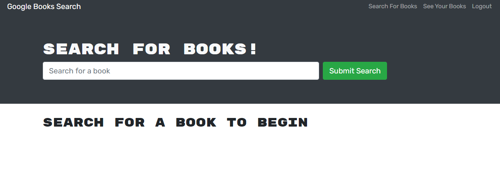
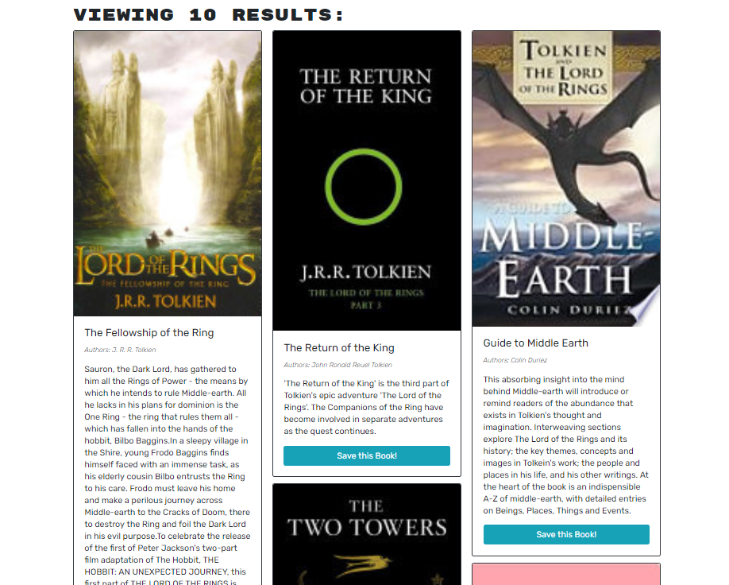

# Book Search
 

## Description
Book Search uses the Google Books API to let you search for any book title and find results for that book. The search results are displayed with the book's title, image and description. You can signup to create a username and save your favorite books to display in your saved books page. There saved books are persistent and will still show up when you log out and return to the app.

#### Main Page:

#### Search Results:

  ## Table of Contents
  - [Tech Used](#tech-used)
  - [Contact](#contact)
  - [Links](#links)
  - [License](#license)
  
  ## Technology Used
  
    
  
  
  

  
  ## Contact
  Please visit my **[GitHub profile](https://github.com/tchestnut85/)** to check out this and other projects I've created and contributed to.
  Contact me at **thomaschestnut00@gmail.com** with any questions or if you'd like to collaborate.

  ## Links
  - **[Deployed App](https://tchestnut85.github.io/react-portfolio/)**
  - **[GitHub Repo](https://github.com/tchestnut85/react-portfolio)**
  - **[My Portfolio](https://tchestnut85.github.io/react-portfolio)**
  - **[Connect on LinkedIn](https://www.linkedin.com/in/thomas-chestnut)**

  ## Credits
  - **[React](https://reactjs.org/)**
  - **[FontAwesome for React](https://fontawesome.com/how-to-use/on-the-web/using-with/react)**